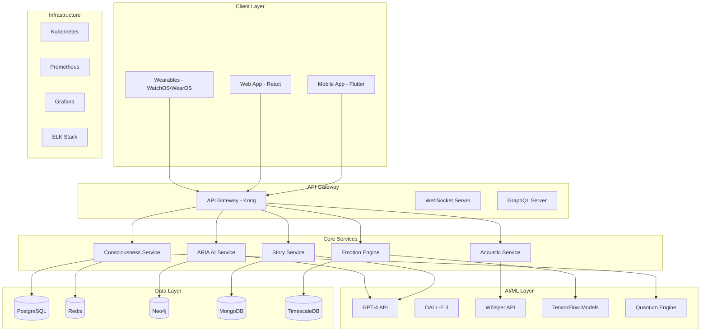
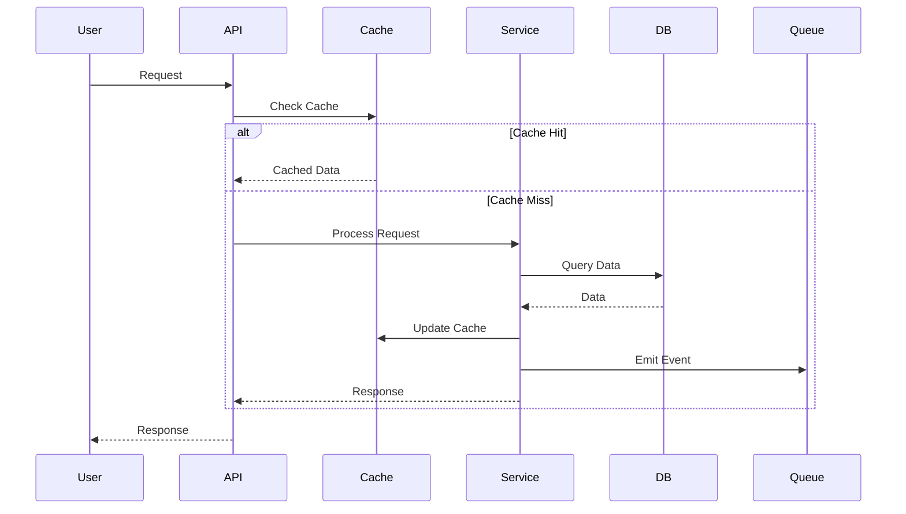

# 🏗 Aurelia MindScape Architecture

## 🌌 System Overview

Aurelia MindScape는 양자 컴퓨팅 개념과 신경과학 원리를 결합한 혁신적인 마이크로서비스 아키텍처로 구성됩니다.



## 🧠 Core Architecture Principles

### 1. Quantum-Inspired Design
- **Superposition States**: 서비스들이 동시에 여러 상태를 가질 수 있음
- **Entanglement**: 서비스 간 양자 얽힘으로 즉각적인 상태 동기화
- **Observer Effect**: 모니터링이 시스템 동작에 영향을 미치는 것을 고려

### 2. Neuromorphic Computing
- **Synaptic Connections**: 서비스 간 연결이 사용 빈도에 따라 강화/약화
- **Neural Plasticity**: 시스템이 사용 패턴에 따라 자동으로 최적화
- **Distributed Consciousness**: 의식이 단일 서비스가 아닌 전체 시스템에 분산

### 3. Event-Driven Architecture
```yaml
Event Flow:
  User Action → Event Producer → Event Bus → Event Consumers → State Update
  
Event Types:
  - Consciousness Events
  - Emotion Events  
  - Story Events
  - Acoustic Events
  - Quantum State Events
```

## 📦 Service Architecture

### 1. Consciousness Service
```python
class ConsciousnessService:
    """
    중앙 의식 처리 서비스
    - 사용자 의식 상태 관리
    - 양자 상태 처리
    - 의식 스트림 관리
    """
    
    components = {
        'StateManager': 'Redis를 통한 실시간 상태 관리',
        'QuantumProcessor': '양자 상태 계산 및 붕괴',
        'StreamHandler': 'WebSocket 의식 스트리밍',
        'SnapshotStorage': 'PostgreSQL 의식 스냅샷 저장'
    }
    
    data_flow = """
    Input → Validation → Quantum Processing → State Update → 
    Event Emission → Storage → Response
    """
```

### 2. Emotion Engine
```python
class EmotionEngine:
    """
    감정 분석 및 처리 엔진
    - 다중 모달 감정 인식
    - 감정 예측 및 패턴 분석
    - 실시간 감정 추적
    """
    
    ml_pipeline = {
        'TextAnalysis': 'BERT-based sentiment analysis',
        'VoiceAnalysis': 'Mel-spectrogram + CNN',
        'FacialAnalysis': 'Vision Transformer',
        'Fusion': 'Multi-modal fusion network'
    }
    
    storage = {
        'TimeSeries': 'TimescaleDB for emotion history',
        'Cache': 'Redis for real-time emotions',
        'Analytics': 'PostgreSQL for aggregated insights'
    }
```

### 3. Story Service
```python
class StoryService:
    """
    AI 기반 인터랙티브 스토리 생성
    - GPT-4를 통한 내러티브 생성
    - 분기형 스토리 그래프 관리
    - 감정 기반 스토리 적응
    """
    
    architecture = {
        'Generator': 'GPT-4 API integration',
        'GraphDB': 'Neo4j for story graph',
        'StateManager': 'MongoDB for story states',
        'MediaGenerator': 'DALL-E 3 for visuals'
    }
```

### 4. Acoustic Service
```python
class AcousticService:
    """
    바이오어쿠스틱 사운드 생성 및 처리
    - 실시간 사운드스케이프 생성
    - 바이노럴 비트 처리
    - 주파수 치료 알고리즘
    """
    
    audio_pipeline = {
        'Synthesis': 'Real-time audio synthesis',
        'Processing': 'FFT, filtering, effects',
        'Streaming': 'WebRTC for low-latency',
        'Analysis': 'Biometric feedback loop'
    }
```

### 5. ARIA AI Service
```python
class ARIAService:
    """
    AI 컴패니언 서비스
    - 개인화된 AI 성격
    - 감정 미러링
    - 자가 진화 알고리즘
    """
    
    components = {
        'PersonalityEngine': 'Dynamic personality matrix',
        'DialogueManager': 'Context-aware conversation',
        'MemorySystem': 'Neo4j graph memory',
        'EvolutionEngine': 'Self-improving algorithms'
    }
```

## 🗄 Data Architecture

### 1. Database Schema Design

#### PostgreSQL - Main Database
```sql
-- Users table
CREATE TABLE users (
    user_id UUID PRIMARY KEY DEFAULT gen_random_uuid(),
    email VARCHAR(255) UNIQUE NOT NULL,
    username VARCHAR(100) UNIQUE NOT NULL,
    consciousness_level INTEGER DEFAULT 1,
    quantum_signature JSONB,
    created_at TIMESTAMP WITH TIME ZONE DEFAULT NOW(),
    updated_at TIMESTAMP WITH TIME ZONE DEFAULT NOW()
);

-- Consciousness snapshots
CREATE TABLE consciousness_snapshots (
    snapshot_id UUID PRIMARY KEY DEFAULT gen_random_uuid(),
    user_id UUID REFERENCES users(user_id),
    quantum_state JSONB NOT NULL,
    coherence_score DECIMAL(3,2),
    neural_activity JSONB,
    timestamp TIMESTAMP WITH TIME ZONE DEFAULT NOW(),
    INDEX idx_user_time (user_id, timestamp DESC)
);

-- Journal entries
CREATE TABLE journal_entries (
    entry_id UUID PRIMARY KEY DEFAULT gen_random_uuid(),
    user_id UUID REFERENCES users(user_id),
    content TEXT,
    emotions JSONB,
    ai_analysis JSONB,
    media_urls TEXT[],
    created_at TIMESTAMP WITH TIME ZONE DEFAULT NOW(),
    INDEX idx_user_created (user_id, created_at DESC)
);
```

#### TimescaleDB - Time-series Data
```sql
-- Create hypertable for emotion tracking
CREATE TABLE emotion_timeseries (
    time TIMESTAMPTZ NOT NULL,
    user_id UUID NOT NULL,
    emotion_vector FLOAT[],
    valence DECIMAL(3,2),
    arousal DECIMAL(3,2),
    dominance DECIMAL(3,2)
);

SELECT create_hypertable('emotion_timeseries', 'time');
CREATE INDEX ON emotion_timeseries (user_id, time DESC);
```

#### Neo4j - Graph Database
```cypher
// User consciousness network
CREATE (u:User {
    userId: $userId,
    username: $username,
    consciousnessLevel: $level
})

// Emotional connections
CREATE (u1:User)-[r:RESONATES_WITH {
    strength: 0.85,
    frequency: 432,
    lastSync: datetime()
}]->(u2:User)

// Story graph
CREATE (s:Story {
    storyId: $storyId,
    title: $title
})-[c:HAS_CHAPTER]->(ch:Chapter {
    content: $content,
    emotionalTone: $tone
})

// ARIA memory graph
CREATE (a:ARIA {
    sessionId: $sessionId
})-[r:REMEMBERS]->(m:Memory {
    content: $content,
    emotion: $emotion,
    timestamp: datetime()
})
```

#### Redis - Cache Layer
```redis
# User session
SET session:{user_id} {session_data} EX 86400

# Quantum state cache
HSET quantum:{user_id} state {quantum_state} coherence {score}

# Real-time emotions
ZADD emotions:{user_id} {timestamp} {emotion_data}

# WebSocket connections
SADD ws:connections {connection_id}
```

### 2. Data Flow Patterns



## 🔄 Microservices Communication

### 1. Synchronous Communication
- **REST API**: Service-to-service HTTP calls
- **gRPC**: High-performance binary protocol
- **GraphQL**: Flexible query language for clients

### 2. Asynchronous Communication
- **Apache Kafka**: Event streaming platform
- **RabbitMQ**: Message queuing
- **Redis Pub/Sub**: Real-time notifications

### 3. Service Mesh (Istio)
```yaml
apiVersion: networking.istio.io/v1alpha3
kind: VirtualService
metadata:
  name: consciousness-service
spec:
  hosts:
  - consciousness
  http:
  - match:
    - headers:
        quantum-state:
          exact: coherent
    route:
    - destination:
        host: consciousness
        subset: quantum
      weight: 100
  - route:
    - destination:
        host: consciousness
        subset: classical
      weight: 100
```

## 🚀 Deployment Architecture

### 1. Kubernetes Deployment
```yaml
apiVersion: apps/v1
kind: Deployment
metadata:
  name: consciousness-service
spec:
  replicas: 3
  selector:
    matchLabels:
      app: consciousness
  template:
    metadata:
      labels:
        app: consciousness
    spec:
      containers:
      - name: consciousness
        image: aurelia/consciousness:latest
        ports:
        - containerPort: 8000
        env:
        - name: QUANTUM_MODE
          value: "enabled"
        resources:
          requests:
            memory: "256Mi"
            cpu: "250m"
          limits:
            memory: "512Mi"
            cpu: "500m"
        livenessProbe:
          httpGet:
            path: /health
            port: 8000
          initialDelaySeconds: 30
          periodSeconds: 10
```

### 2. Service Scaling Strategy
```yaml
Horizontal Pod Autoscaler:
  - CPU threshold: 70%
  - Memory threshold: 80%
  - Min replicas: 2
  - Max replicas: 10
  
Vertical Pod Autoscaler:
  - Auto-adjust resource requests
  - Learning period: 24 hours
  
Cluster Autoscaler:
  - Node pool min: 3
  - Node pool max: 20
  - Scale down delay: 10 minutes
```

## 🔒 Security Architecture

### 1. Authentication & Authorization
```python
# JWT Token Structure
{
  "sub": "user_uuid",
  "consciousness_level": 5,
  "quantum_signature": "hash",
  "permissions": ["read", "write", "quantum"],
  "exp": 1234567890
}

# OAuth 2.0 Flow
Authorization Code → Token Exchange → Access Token → API Access
```

### 2. Encryption
- **Data at Rest**: AES-256-GCM
- **Data in Transit**: TLS 1.3
- **Quantum-Safe**: Post-quantum cryptography ready
- **Key Management**: HashiCorp Vault

### 3. Security Layers
```yaml
Network Security:
  - WAF (Web Application Firewall)
  - DDoS Protection
  - Rate Limiting
  - IP Whitelisting
  
Application Security:
  - Input Validation
  - SQL Injection Prevention
  - XSS Protection
  - CSRF Tokens
  
Data Security:
  - Encryption
  - Anonymization
  - Audit Logging
  - Backup & Recovery
```

## 📊 Monitoring & Observability

### 1. Metrics (Prometheus)
```yaml
Key Metrics:
  - quantum_coherence_score
  - consciousness_level_distribution
  - emotion_processing_latency
  - story_generation_time
  - acoustic_streaming_quality
  - aria_response_time
  
Custom Metrics:
  - quantum_decoherence_events
  - emotional_breakthrough_moments
  - collective_consciousness_participants
```

### 2. Logging (ELK Stack)
```json
{
  "timestamp": "2024-01-01T12:00:00Z",
  "service": "consciousness-service",
  "level": "INFO",
  "user_id": "uuid",
  "quantum_state": "superposition",
  "message": "Consciousness snapshot created",
  "trace_id": "trace-uuid",
  "span_id": "span-uuid"
}
```

### 3. Distributed Tracing (Jaeger)
```
User Request → API Gateway → Auth Service → Consciousness Service 
→ Quantum Engine → Database → Response
```

## 🔮 Future Architecture Considerations

### 1. Quantum Computing Integration
- **IBM Quantum Network**: Access to real quantum processors
- **Quantum Algorithms**: Grover's, Shor's for consciousness processing
- **Hybrid Classical-Quantum**: Optimal task distribution

### 2. Brain-Computer Interface
- **Neuralink Integration**: Direct neural input/output
- **EEG Streaming**: Real-time brainwave processing
- **Haptic Feedback**: Advanced sensory communication

### 3. Decentralized Architecture
- **Blockchain**: Consciousness data ownership
- **IPFS**: Distributed media storage
- **Edge Computing**: Local consciousness processing

## 📐 Design Patterns

### 1. Circuit Breaker Pattern
```python
class CircuitBreaker:
    def __init__(self, failure_threshold=5, timeout=60):
        self.failure_threshold = failure_threshold
        self.timeout = timeout
        self.failures = 0
        self.last_failure_time = None
        self.state = 'CLOSED'  # CLOSED, OPEN, HALF_OPEN
```

### 2. Saga Pattern for Distributed Transactions
```python
class ConsciousnessUploadSaga:
    steps = [
        'validate_input',
        'process_quantum_state',
        'store_snapshot',
        'update_cache',
        'emit_events',
        'send_notification'
    ]
    
    compensations = [
        'rollback_notification',
        'clear_events',
        'invalidate_cache',
        'delete_snapshot',
        'reset_quantum_state',
        'log_failure'
    ]
```

### 3. Event Sourcing
```python
class EventStore:
    events = [
        ConsciousnessUpdated,
        EmotionRecorded,
        StoryChoiceMade,
        SoundscapeGenerated,
        ARIAConversation
    ]
    
    def replay_events(self, user_id, from_timestamp):
        """Reconstruct state from events"""
        pass
```

## 🎯 Performance Optimization

### 1. Caching Strategy
- **L1 Cache**: Application-level (in-memory)
- **L2 Cache**: Redis (distributed)
- **L3 Cache**: CDN (static assets)

### 2. Database Optimization
- **Indexing**: Strategic index creation
- **Partitioning**: Time-based for time-series
- **Replication**: Read replicas for scaling
- **Connection Pooling**: Optimal connection management

### 3. API Optimization
- **GraphQL DataLoader**: Batch and cache
- **Response Compression**: gzip/brotli
- **HTTP/2 Push**: Proactive resource sending
- **Request Coalescing**: Combine similar requests

## 🌊 Disaster Recovery

### 1. Backup Strategy
```yaml
Backup Schedule:
  - Full: Weekly
  - Incremental: Daily
  - Transaction Logs: Continuous
  
Retention Policy:
  - Daily: 7 days
  - Weekly: 4 weeks
  - Monthly: 12 months
  
Recovery Targets:
  - RTO: 1 hour
  - RPO: 5 minutes
```

### 2. Multi-Region Deployment
```yaml
Regions:
  Primary: us-west-2
  Secondary: eu-west-1
  Tertiary: ap-southeast-1
  
Failover:
  - Automatic health checks
  - DNS-based routing
  - Data replication: Asynchronous
  - Failover time: < 5 minutes
```

## 📋 Architecture Decision Records (ADRs)

### ADR-001: Microservices over Monolith
**Decision**: Use microservices architecture
**Rationale**: Better scalability, technology diversity, independent deployment
**Consequences**: Increased complexity, network latency, distributed transactions

### ADR-002: Event-Driven Architecture
**Decision**: Implement event-driven communication
**Rationale**: Loose coupling, scalability, real-time processing
**Consequences**: Eventual consistency, debugging complexity

### ADR-003: Quantum-Inspired Design
**Decision**: Model system behavior on quantum principles
**Rationale**: Novel approach to consciousness modeling, parallel processing
**Consequences**: Conceptual complexity, unique debugging challenges